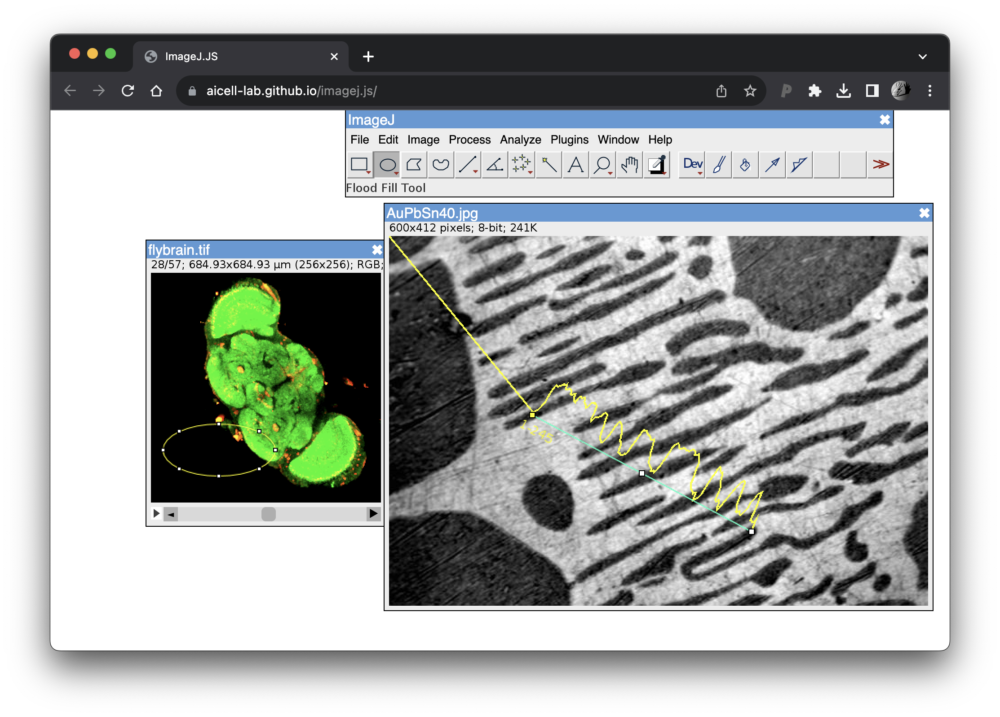
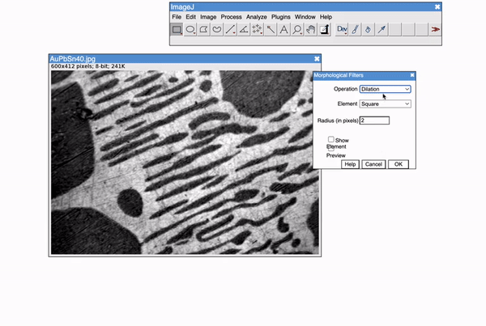

# ImageJ.JS

**Run ImageJ directly in your browser - no installation, no server, just powerful image analysis anywhere.**

ImageJ.JS brings the full power of ImageJ to the web, enabling professional image analysis on any device with a modern browser. Originally created during a hackathon in Dresden and evolved through the ImJoy project, ImageJ.JS now serves **1,000-1,500 unique users daily** for scientific image analysis, education, and research.

**The new version is now available at https://ij.aicell.io**

If you want to try our previous version: https://ij.imjoy.io




---

## 🚀 What's New in This Version

This is a **complete reimagining** of ImageJ.JS, powered by [CheerpJ 3](https://cheerpj.com/) - a breakthrough WebAssembly compiler that runs Java applications directly in your browser without any preprocessing. This unlocks capabilities that were impossible in previous versions:

### Previous Limitations (Old Version)
- ❌ **4GB file size limit** - Could not handle large microscopy datasets
- ❌ **Limited plugin support** - Most ImageJ plugins required extensive modifications
- ❌ **No local file access** - Files had to be manually uploaded and downloaded
- ❌ **Pre-compilation required** - Every Java class needed conversion before use

### New Capabilities (This Version)
- ✅ **No file size limits** - Process files larger than available memory
- ✅ **Universal plugin support** - Load any ImageJ plugin (MorphoLibJ, ThunderSTORM, etc.) without modification
- ✅ **Direct file system access** - Read and write files directly from your computer (Chrome/Edge)
- ✅ **Zero compilation** - Load JARs directly, just like desktop ImageJ
- ✅ **AI-powered assistance** - Connect to Large Language Models via Model Context Protocol
- ✅ **GitHub plugin repositories** - Share and load custom plugins via URL
- ✅ **Better JavaScript integration** - Call Java classes directly from JavaScript



---

## 🎯 For Users: What Can You Do?

### 1. **Analyze Images Anywhere**
Open ImageJ.JS in your browser and start analyzing images immediately - no software installation required. Works on:
- 💻 **Desktop computers** (Windows, Mac, Linux)
- 📱 **Tablets and iPads** - Full ImageJ interface optimized for touch
- 🌐 **Any modern browser** - Chrome, Edge, Safari, Firefox

### 2. **Work with Your Local Files** (Chrome/Edge)
Unlike other web apps that force you to upload files, ImageJ.JS can access your computer's folders directly:
- Click **"Mount Local Folder"** to give ImageJ access to a folder
- Open, process, and save images **directly** to your disk
- Changes appear **instantly** in your file explorer
- No file size limits, no uploads, no downloads

**Perfect for:** Large microscopy files, batch processing folders, real-time workflows

### 3. **Load Custom Plugins from GitHub**
Create a shareable link that loads ImageJ with your custom plugins pre-installed:

```
https://ij.aicell.io/?mount=github:yourname/yourplugins@main&plugins.dir=/github/yourname/yourplugins@main/plugins
```

Anyone who opens this link gets ImageJ with your plugins ready to use!

**Use cases:**
- 🎓 **Teaching** - Share ImageJ with pre-configured plugins for students
- 🔬 **Research** - Distribute reproducible analysis pipelines
- 🤝 **Collaboration** - Share workflows without complicated setup
- 📦 **Plugin development** - Test plugins without local installation

[**See the Plugin Repository Guide →**](imagej-examples/README.md#-hosting-your-own-plugin-repository)

### 4. **AI-Powered Image Analysis**
Connect ImageJ.JS to AI assistants (ChatGPT, Claude, etc.) via the **Model Context Protocol** to:
- 💬 **Describe what you want** - AI generates ImageJ macros for you
- 📸 **Show results** - AI can see screenshots of your images
- 🧠 **Learn from examples** - Built-in knowledge base of working code
- 🔄 **Iterate quickly** - AI helps debug and refine your analysis

**Example workflow:**
1. Open your image in ImageJ.JS
2. Click "Connect to Hypha" and add to your AI assistant
3. Tell the AI: "Segment the cells and measure their areas"
4. AI generates and runs the macro automatically
5. View results and refine as needed


### 5. **Drag and Drop Files**
Don't want to mount folders? Just drag files or folders from your computer directly into the browser window. They'll be available instantly at `/local/` for processing.

### 6. **Access Files from GitHub**
Process images directly from public GitHub repositories without downloading:

```
https://ij.aicell.io/?mount=github:owner/repo@main
```

Files appear at `/github/owner/repo/` in ImageJ's file dialogs.

**Perfect for:** Shared datasets, collaborative projects, public image databases, reproducible research

### 7. **Export and Import ROIs as GeoJSON**
Seamlessly convert ImageJ ROIs to/from standard GeoJSON format:
- 📤 **Export ROIs** - Convert any ImageJ ROI (rectangle, polygon, ellipse, etc.) to GeoJSON
- 📥 **Import ROIs** - Load ROIs from GeoJSON into ImageJ and ROI Manager
- 🔄 **Interoperability** - Integrate with web mapping tools, QuPath, spatial databases
- 🤖 **AI Integration** - Let AI assistants create and modify ROIs using standard formats

**Supported geometry types:** Point, MultiPoint, LineString, Polygon, MultiPolygon, GeometryCollection

[**Learn more about ROI ↔ GeoJSON conversion →**](ROI_GEOJSON_CONVERSION.md)

---

## 🎓 For Researchers & Educators

### Teaching Image Analysis
- **No installation barriers** - Students start analyzing images in seconds
- **Consistent environment** - Everyone uses the exact same ImageJ version
- **Pre-configured setups** - Share URLs with plugins and datasets ready to go
- **Cross-platform** - Works on university computers, personal laptops, even iPads

### Reproducible Research
- **Version control** - Store ImageJ plugins alongside your data in Git
- **Shareable analysis** - Send collaborators a single URL with everything needed
- **Document workflows** - Link to specific ImageJ configurations in papers
- **Long-term preservation** - Analysis stays accessible even if software evolves

### Remote Collaboration
- **No file transfers** - Work directly with files in shared GitHub repositories
- **Universal access** - Analyze images from anywhere with internet
- **Real-time updates** - Push plugin updates to GitHub, everyone gets them instantly

---

## 💡 Real-World Examples

### Example 1: Teaching a Microscopy Course
```
https://ij.aicell.io/?mount=github:university/microscopy-course@2024&plugins.dir=/github/university/microscopy-course@2024/plugins
```
- Repository contains sample images and custom plugins for exercises
- Students click the link and immediately have ImageJ ready
- No software installation or configuration required
- Professor updates examples by pushing to GitHub

### Example 2: Lab Image Analysis
```
https://ij.aicell.io/
```
1. Mount your lab's shared network folder (Chrome/Edge)
2. Process images with full file system integration
3. Save results directly back to shared storage
4. AI assistant helps write custom macros for your analysis

### Example 3: Conference Demonstration
```
https://ij.aicell.io/?mount=github:yourlab/paper-2024@main&plugins.dir=/github/yourlab/paper-2024@main/plugins
```
- Share this URL in your presentation
- Audience can reproduce your analysis during the talk
- All data, plugins, and configurations are pre-loaded
- Works on conference WiFi, no installation needed

---

## 🏆 Key Features at a Glance

| Feature | Description | Browser Support |
|---------|-------------|-----------------|
| **Drag & Drop** | Drop files/folders into browser to process | All browsers |
| **GitHub Integration** | Access files and plugins from GitHub repos | All browsers |
| **Plugin Support** | Load any ImageJ/Fiji plugin without modification | All browsers |
| **AI Assistant Integration** | Connect to ChatGPT, Claude, etc. via MCP | All browsers |
| **ROI ↔ GeoJSON** | Export/import ROIs in standard GeoJSON format | All browsers |
| **Large Files** | No file size limits with mounted folders | All browsers |
| **Mobile Support** | Full ImageJ interface on tablets/iPads | All browsers |
| **Offline Capable** | IndexedDB storage for offline work | All browsers |
| **Native Folder Access** | Read/write files directly from your computer | Chrome, Edge |

---

## 🛠️ Technical Highlights

### For Developers

This version includes several groundbreaking technical achievements:

#### 1. Custom File System Backend
- **Multiple file systems** running simultaneously:
  - **Native FS**: Direct access to local folders via File System Access API
  - **GitHub FS**: HTTP-based access to repositories with zero API calls using `index.list` files
  - **Local FS**: In-memory storage for drag-and-drop files
  - **IndexedDB FS**: Persistent browser storage for offline work

#### 2. Zero GitHub API Dependency
- Novel `index.list` format with type prefixes (`dir:folder` vs `file.jar`)
- Recursive validation ensures non-existent paths fail immediately
- HEAD requests only for files that exist in index
- No rate limiting issues, unlimited requests

#### 3. Hypha MCP Integration
Rich API for AI assistants and remote control:

**Core Tools:**
- `runMacro(macro)` - Execute ImageJ macro code
- `executeJavaScript(code)` - Direct Java API access
- `takeScreenshot()` - Capture visual results
- `getImageInfo()`, `listImages()` - Query image state

**Knowledge Base Tools:**
- `searchCommands(query)` - Find ImageJ commands
- `listExamples(category)` - Browse working examples
- `readExample(path)` - Get full code examples
- `searchExamples(query)` - Keyword search
- `saveExample(path, content)` - Contribute new examples

**ROI & Analysis Tools:**
- `getRoisAsGeoJson()` - Export ROIs as GeoJSON FeatureCollection
- `setRoisFromGeoJson()` - Import ROIs from GeoJSON format
- `getTextFromTable()` - Extract measurement tables as text
- `listFiles(pattern)` - List and read files from virtual file system

[**See full MCP API documentation →**](imagej-examples/USAGE.md)
[**ROI ↔ GeoJSON Conversion Guide →**](ROI_GEOJSON_CONVERSION.md)

#### 4. CheerpJ Internal Patching
Deep integration with CheerpJ internals:
- Patched `IdbOps` for custom file system routing
- Patched `DirectDownloader` for flexible HTTP handling
- Patched `Interpreter` for silent macro execution
- Dynamic Java-JavaScript interop via `window.lib`

[**Read Technical Deep Dive →**](#technical-deep-dive)

---

## 🚦 Getting Started

### Quick Start (Users)
1. Visit **https://ij.aicell.io/** (or run locally)
2. ImageJ loads automatically
3. Start analyzing images!

### Quick Start (With Your Plugins)
1. Create a GitHub repository with your plugins
2. Add `index.list` files ([see guide](imagej-examples/README.md#step-2-generate-indexlist-files))
3. Share this URL:
   ```
   https://ij.aicell.io/?mount=github:you/repo@main&plugins.dir=/github/you/repo@main/plugins
   ```

### Quick Start (Developers)
```bash
# Clone repository
git clone https://github.com/imjoy-team/imagej.js2.git
cd imagej.js2

# Download ImageJ
sh prepare.sh

# Install dependencies
npm install

# Start dev server (supports Range headers)
npm run dev

# Open browser
open http://localhost:8000
```

---

## 📚 Documentation

### User Guides
- [**Plugin Repository Setup**](imagej-examples/README.md#-hosting-your-own-plugin-repository) - Host plugins on GitHub
- [**Knowledge Base Examples**](imagej-examples/README.md) - Working code examples
- [**ROI ↔ GeoJSON Conversion**](ROI_GEOJSON_CONVERSION.md) - Export/import ROIs in standard format
- [**Browser Compatibility**](#browser-compatibility) - What works where

### Developer Guides
- [**Technical Architecture**](#architecture--implementation) - How it all works
- [**File System Implementation**](#file-system-hierarchy) - Custom FS backends
- [**MCP API Reference**](imagej-examples/USAGE.md) - Remote control interface
- [**Debugging Tips**](#debugging-tips) - Troubleshooting guide

### Blog Posts
- [**Original Journey: CheerpJ 3 to 4.x**](https://aicell.io/post/improving-imagej.js/) - Early development story

---

## 🌐 Browser Compatibility

### Fully Supported ✅
- **Chrome 86+** (Desktop) - All features including native folder mounting
- **Edge 86+** (Desktop) - All features including native folder mounting

### Partial Support ⚠️
- **Safari** - No native folder mounting, use drag-and-drop or GitHub mounting
- **Firefox** - No native folder mounting, use drag-and-drop or GitHub mounting
- **Mobile browsers** - Full ImageJ functionality, limited file system features

### Feature Matrix

| Feature | Chrome/Edge | Safari/Firefox | Mobile |
|---------|-------------|----------------|--------|
| Native Folder Mount | ✅ Full | ❌ | ❌ |
| Drag & Drop Files | ✅ Full | ✅ Full | ⚠️ Limited |
| GitHub Repositories | ✅ Full | ✅ Full | ✅ Full |
| Plugin Support | ✅ Full | ✅ Full | ✅ Full |
| AI/MCP Integration | ✅ Full | ✅ Full | ✅ Full |

---

## ⚡ Performance & Limitations

### What Works Well
- ✅ Most ImageJ plugins (MorphoLibJ, ThunderSTORM, etc.)
- ✅ Batch processing with mounted folders
- ✅ Large file handling (>4GB) with native FS
- ✅ Real-time file system integration

### Known Limitations
- ⚠️ **Performance**: Worse than desktop due to WebAssembly overhead and also it only run in a single thread (although it appears that multi-thread in java can run through the cheerpj emulation)
- ⚠️ **Multi-threading**: Limited by browser security (no shared memory)
- ⚠️ **Native libraries**: Plugins requiring native code may not work
- ⚠️ **GitHub rate limits**: Repositories without `index.list` files hit API limits

### Best Practices
- 💡 Use **mounted folders** for large datasets (Chrome/Edge)
- 💡 Create **`index.list` files** for GitHub repositories to avoid rate limits
- 💡 Use **drag-and-drop** for quick one-off file processing
- 💡 Enable **AI assistance** to help write efficient macros

---

## 🤝 Contributing

We welcome contributions to make ImageJ.JS better!

### Ways to Contribute
- 🐛 **Report bugs** - Help us improve stability
- 📖 **Add knowledge base examples** - Share working code
- 🔌 **Test plugins** - Report compatibility issues
- 🌍 **Improve documentation** - Help others get started
- 💻 **Code contributions** - Performance, features, browser support

### Priority Areas
- Safari/Firefox file system alternatives
- Additional plugin compatibility testing
- Performance optimizations
- Mobile user experience
- AI integration improvements

---

## 📖 References & Credits

### Technology Stack
- [**CheerpJ**](https://cheerpj.com/) - WebAssembly JVM compiler
- [**ImageJ**](https://imagej.net/) - The foundational image analysis software
- [**Hypha**](https://github.com/amun-ai/hypha) - Model Context Protocol server
- [**ImJoy**](https://imjoy.io/) - The project that evolved this tool

### Related Projects
- [**ImJoy.io**](https://imjoy.io/) - Plugin framework for scientific computing
- [**BioImage.IO**](https://bioimage.io/) - AI model repository
- [**Fiji**](https://fiji.sc/) - ImageJ distribution for scientific image analysis

### Blog Posts & Documentation
- [Improving ImageJ.JS](https://aicell.io/post/improving-imagej.js/) - Development journey
- [CheerpJ Documentation](https://cheerpj.com/docs/) - WebAssembly JVM docs
- [File System Access API](https://developer.mozilla.org/en-US/docs/Web/API/File_System_Access_API) - Native FS standard

---

## 🎉 From Hackathon to Daily Tool

ImageJ.JS started as an experimental project at a hackathon in Dresden, exploring whether powerful desktop applications could truly run in web browsers. That experiment evolved through the ImJoy project, serving researchers who needed image analysis on iPads and in Jupyter notebooks.

With the advent of CheerpJ 3 and now CheerpJ 4.2, we've reached a turning point: **ImageJ.JS is no longer a proof-of-concept, but a production-ready tool** serving over 1,000 users daily for real scientific work.

The addition of AI integration via Model Context Protocol represents another leap forward - making professional image analysis accessible not just to those who can install desktop software, but to anyone who can describe what they want to achieve.

**This is ImageJ, unbound from desktop constraints, ready for the next generation of scientists.**

---

## 📄 License

- **ImageJ**: Public domain
- **CheerpJ**: Community Edition (free for non-commercial use, [commercial license](https://cheerpj.com/) required for commercial use)
- **This project**: Open source (see individual component licenses)

---

## 💬 Get Help & Connect

- 🐛 **Issues**: [GitHub Issues](https://github.com/imjoy-team/imagej.js2/issues)
- 💬 **Discussions**: [GitHub Discussions](https://github.com/imjoy-team/imagej.js2/discussions)
- 📧 **Contact**: Open an issue or discussion

---

## 🔧 Technical Deep Dive

<details>
<summary><strong>For developers who want to understand the internals...</strong></summary>

## What is CheerpJ?

[CheerpJ](https://cheerpj.com/) is a WebAssembly-based Java Virtual Machine that runs entirely in the browser:

- **Direct JAR Loading**: Load `.jar` files directly without preprocessing
- **JVM in WASM**: Complete Java runtime compiled to WebAssembly
- **Dynamic Patching**: Override Java methods with JavaScript at runtime
- **Virtual File System**: Complete POSIX-like file system via IndexedDB

### CheerpJ 4.2 API

```javascript
// Initialize CheerpJ
await cheerpjInit({
  clipboardMode: "java",
  javaProperties: [
    "user.dir=/files",
    "plugins.dir=/app/lib/ImageJ/plugins"
  ]
});

// Create display area
cheerpjCreateDisplay(-1, -1, element);

// Run ImageJ
await cheerpjRunJar("/app/lib/ImageJ/ij.jar");
```

## Architecture & Implementation

### File System Hierarchy

```
/                      # Root (CheerpJRootFolder)
├── /app/             # HTTP-served files (CheerpJWebFolder)
│   └── /lib/ImageJ/  # ImageJ installation
├── /files/           # Native/IndexedDB storage (persistent)
├── /local/           # Drag-and-drop files (in-memory, temporary)
├── /github/          # GitHub repos (HTTP, read-only)
│   └── owner/repo@branch/
├── /lt/              # CheerpJ runtime
└── /dev/             # Device files
```

### Native File System Integration

Located in `utils.js`, this patches CheerpJ's internal file system operations:

```javascript
class NativeFileSystemHandler {
  async loadDirectory() {
    // File System Access API
    this.directoryHandle = await window.showDirectoryPicker();
  }

  async getFileHandle(path) {
    // Navigate path segments
    let handle = this.directoryHandle;
    const parts = path.split('/').filter(p => p);

    for (let i = 0; i < parts.length - 1; i++) {
      handle = await handle.getDirectoryHandle(parts[i]);
    }

    return await handle.getFileHandle(parts[parts.length - 1]);
  }
}
```

### GitHub File System

Zero-API-call implementation using `index.list` files:

```javascript
class GitHubFileSystemHandler {
  // index.list format:
  // dir:foldername    <- directory
  // file.jar          <- file

  async getTypeFromParentIndexList(path) {
    // 1. Verify all ancestor directories exist
    // 2. Check parent's index.list for entry
    // 3. Return 'directory', 'file', or null
  }

  async getFileInfo(path) {
    const type = await this.getTypeFromParentIndexList(path);

    if (type === 'directory') {
      return { type: 'directory', size: 0 };
    } else if (type === 'file') {
      // HEAD request only for confirmed files
      const response = await fetch(url, { method: 'HEAD' });
      return {
        type: 'file',
        size: parseInt(response.headers.get('content-length')),
        downloadUrl: url
      };
    } else {
      return null; // Doesn't exist
    }
  }
}
```

**Key optimization**: Recursive ancestor validation ensures we never make requests for non-existent paths.

### IdbOps Patching

CheerpJ exposes internal file system operations:

```javascript
var IdbOps = {
  statAsync,      // Get file metadata
  listAsync,      // List directory
  makeFileData,   // Open file
  createDirAsync, // Make directory
  renameAsync,    // Rename
  linkAsync,      // Symlink
  unlinkAsync     // Delete
};

// We patch each to route to custom handlers:
function patchedStatAsync(mp, path, cb) {
  if (path.startsWith('/github/')) {
    return githubStatAsync(mp, path, cb);
  } else if (window.nativeDirectoryHandle && path.startsWith('/files/')) {
    return nativeStatAsync(mp, path, cb);
  } else {
    return originalStatAsync(mp, path, cb);
  }
}
```

### File I/O Flow

**Reading:**
```
ImageJ calls File API
    ↓
CheerpJ intercepts
    ↓
IdbOps.makeFileData (patched)
    ↓
Check path prefix
    ↓
Route to handler (native/github/local)
    ↓
Fetch file data
    ↓
Create CheerpJFileData object
    ↓
Return to ImageJ
```

**Writing (Native FS only):**
```
ImageJ writes data
    ↓
IdbInodeOps.writeAsync (patched)
    ↓
Buffer data in memory
    ↓
IdbInodeOps.close (patched)
    ↓
Create writable stream
    ↓
Write all buffered data
    ↓
Close stream
    ↓
File appears on disk immediately
```

### DirectDownloader Patching

CheerpJ 4.2 requires Range header support. We patch the downloader:

```javascript
function patchDownloader() {
  function ddlSend() {
    var downloader = this;
    var headers = {};
    if (downloader.rangeHeader) {
      headers["Range"] = downloader.rangeHeader;
    }

    fetch(downloader.url, { method: "GET", headers: headers })
      .then(response => ddlOnLoad(response, downloader))
      .catch(err => ddlOnError(downloader, err));
  }

  DirectDownloader.prototype.send = ddlSend;
}
```

## URL Parameters

| Parameter | Description | Example |
|-----------|-------------|---------|
| `mount` | Mount GitHub repo | `?mount=github:owner/repo@branch` |
| `plugins.dir` | Set plugins directory | `?plugins.dir=/github/owner/repo@branch/plugins` |

Multiple parameters: `?mount=github:user/repo@main&plugins.dir=/github/user/repo@main/plugins`

## Development Setup

### Prerequisites
- Node.js and npm
- Modern browser (Chrome 86+, Edge 86+)

### Installation

```bash
# Clone repository
git clone https://github.com/imjoy-team/imagej.js2.git
cd imagej.js2

# Download ImageJ
sh prepare.sh

# Install dependencies
npm install

# Start dev server
npm run dev
```

**Important**: Must use `npm run dev` (not Python's HTTP server) because CheerpJ 4.2 requires Range header support.

## Debugging Tips

### Enable CheerpJ Debug Mode

```javascript
await cheerpjInit({
  enablePreciseAppEnv: true,
  logCanvasUpdates: true
});
```

### Check Patch Status

```javascript
console.log({
  hasDirectDownloader: typeof DirectDownloader !== 'undefined',
  hasIdbOps: typeof IdbOps !== 'undefined',
  nativeFolderMounted: !!window.nativeDirectoryHandle,
  githubFSReady: !!window.githubFS
});
```

### Common Errors

**"HTTP server does not support Range header"**
→ Use `npm run dev`, not Python's `http.server`

**"File not found" in mounted folder**
→ Check folder was mounted and browser supports File System Access API

**ImageJ fails to start**
→ Verify `lib/ImageJ/ij.jar` exists and check console for errors

## Files Structure

```
imagej.js2/
├── index.html                   # Main entry point
├── utils.js                     # File system integration
├── hypha-imagej-service.js      # MCP/Hypha integration
├── package.json                 # Dev dependencies
├── prepare.sh                   # Download ImageJ
├── imagej-examples/             # Knowledge base
│   ├── README.md
│   ├── USAGE.md
│   └── */                      # Category folders
├── docs/
│   └── cheerpOS.js             # CheerpJ internals reference
└── lib/ImageJ/                 # ImageJ (gitignored)
    ├── ij.jar
    ├── plugins/
    └── macros/
```

### Key Implementation Files

**`index.html`**
- CheerpJ initialization
- DirectDownloader patching
- Application bootstrap
- UI event handlers

**`utils.js`**
- `NativeFileSystemHandler` - File System Access API integration
- `LocalFileSystemHandler` - Drag-and-drop in-memory files
- `GitHubFileSystemHandler` - HTTP-based GitHub access with `index.list` optimization
- `createNativeFileSystemPatches()` - IdbOps patching for native FS
- `createLocalFileSystemPatches()` - `/local/` mount point
- `createGitHubFileSystemPatches()` - `/github/` mount point
- File I/O wrappers and async operations

**`hypha-imagej-service.js`**
- MCP service registration
- Remote macro execution
- Screenshot capture
- ROI ↔ GeoJSON bidirectional conversion
- Knowledge base tools
- Results table extraction

## Migration Notes: CheerpJ Versions

### CheerpJ 2 → 3 → 4.2

**CheerpJ 2**:
- Pre-compilation Java → JavaScript required
- No dynamic JAR loading
- Limited plugin support

**CheerpJ 3**:
- ✅ Direct JAR loading
- ✅ Dynamic patching
- ✅ Full classloader support

**CheerpJ 4.2** (current):
- ✅ Java 8, 11, 17 support
- ⚠️ Stricter Range header requirements
- ✅ Improved WASM performance
- ✅ Better stability

### Breaking Changes (4.0 → 4.2)

1. **Range headers now required** - Had to switch from Python's `http.server` to `http-server` npm package
2. **Path concatenation fix** - Fixed `baseUrl` handling for `/index.html` vs `/` routes
3. **API stability** - Internal APIs (`IdbOps`, `DirectDownloader`) remained stable

</details>
